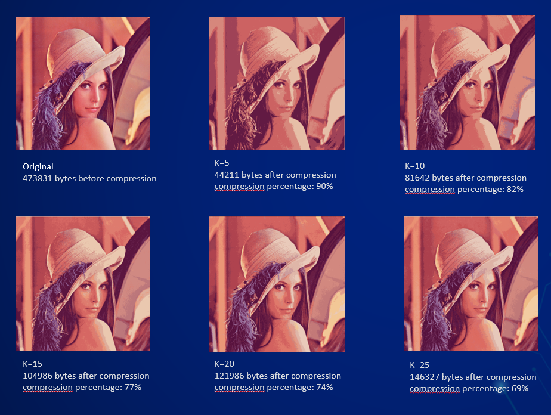

## Background
This project focuses on trying to reduce image size using K-means algorithm. 
This algorithm is considered as lossy algorithm which means you cannot retrieve the original image. 

## About The Algorithm
We used an implementation of the 2D K-means algorithm but on 3D matrix.  We have calculated the distances using norm 2 using linear algebra functions built in Numpy. 
The algorithm is written from scratch. 

## Results

## Pros And Cons
### Pros
1. Significant reduction in image size.
2. Compatibility with various image types.

### Cons
1. It takes a long time because it processes each pixel individually.
2. Optimal performance achieved with PNG file format (based on testing).
3. Limited applicability to RGB images, does not work with binary images.

## Conclusions
I found it fascinating and interesting to explore and study this algorithm and its implementation. 
When I tested it, I realized there are other techniques available that can significantly speed up the process of reducing image size.
